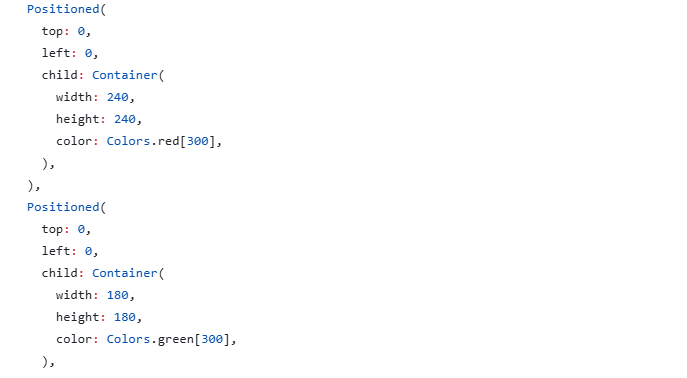
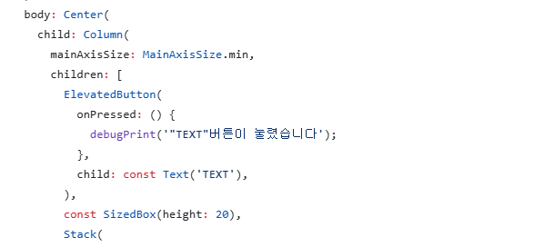

# AIFFEL Campus Online Code Peer Review Templete
- 코더 : 백승호
- 리뷰어 : 최유진


# PRT(Peer Review Template)
- [x]  **1. 주어진 문제를 해결하는 완성된 코드가 제출되었나요?**
    - 문제에서 요구하는 최종 결과물이 첨부되었는지 확인
        - 중요! 해당 조건을 만족하는 부분을 캡쳐해 근거로 첨부
   


네. 문제를 해결하는 완성된 코드가 제출되었습니다.
요구 조건은 다음과 같았습니다.
1. appbar 좌측 상단에 원하는 아이콘을 추가
2. appbar 중앙에 "플러터 앱 만들기" 라는 텍스트 추가
3. appbar 색상 'blue'
4. 화면 중앙에 "Text" 표기된 button을 추가. 해당 버튼을 클릭하면 "버튼이 눌렸습니다. "라는 문장이 Debug Console에 출력되도록 함.
5. 화면 하단의 중앙에 총 5개의 Container가 중첩되게 합니다. container는 정사각형이며, 각각의 컨테이너의 변의 길이는 60씩 증가. (가장 바깥은 300*300)
모두 충족하였습니다.

- [x]  **2. 전체 코드에서 가장 핵심적이거나 가장 복잡하고 이해하기 어려운 부분에 작성된 
주석 또는 doc string을 보고 해당 코드가 잘 이해되었나요?**
    - 해당 코드 블럭을 왜 핵심적이라고 생각하는지 확인
    - 해당 코드 블럭에 doc string/annotation이 달려 있는지 확인
    - 해당 코드의 기능, 존재 이유, 작동 원리 등을 기술했는지 확인
    - 주석을 보고 코드 이해가 잘 되었는지 확인
        - 중요! 잘 작성되었다고 생각되는 부분을 캡쳐해 근거로 첨부
    
Positioned를 사용하여 컨테이너를 잘 배치하였습니다.
        
- [x]  **3. 에러가 난 부분을 디버깅하여 문제를 해결한 기록을 남겼거나
새로운 시도 또는 추가 실험을 수행해봤나요?**
    - 문제 원인 및 해결 과정을 잘 기록하였는지 확인
    - 프로젝트 평가 기준에 더해 추가적으로 수행한 나만의 시도, 
    실험이 기록되어 있는지 확인
    
    승호님의 코드에서 보이지는 않지만 같이 진행하셨던 종호님께서
    다른 방법으로 진행하신 것을 확인할 수 있었습니다. (for문으로 엮어서 간소화)
    각각 코드를 작성하고 비교해보는 과정을 거친 것이 인상깊었습니다.
        
- [x]  **4. 회고를 잘 작성했나요?**
    - 주어진 문제를 해결하는 완성된 코드 내지 프로젝트 결과물에 대해
    배운점과 아쉬운점, 느낀점 등이 기록되어 있는지 확인
    - 전체 코드 실행 플로우를 그래프로 그려서 이해를 돕고 있는지 확인
        - 회고를 깔끔하게 잘 작성하였습니다.
        
- [x]  **5. 코드가 간결하고 효율적인가요?**
    - 파이썬 스타일 가이드 (PEP8) 를 준수하였는지 확인
    - 코드 중복을 최소화하고 범용적으로 사용할 수 있도록 함수화/모듈화했는지 확인
        - 중요! 잘 작성되었다고 생각되는 부분을 캡쳐해 근거로 첨부
        - 코드가 간결하고 효율적으로 작성된 것 같습니다. 
    

# 회고(참고 링크 및 코드 개선)
```
# 리뷰어의 회고를 작성합니다.
# 아까 언급했듯, 각자 코드를 작성해 먼저 비교해보는 과정을 거치신 것이 인상깊었습니다.
# 그리고 저희 팀과 코드가 비슷하게 나온 것 같아서 신기했습니다. 
```
