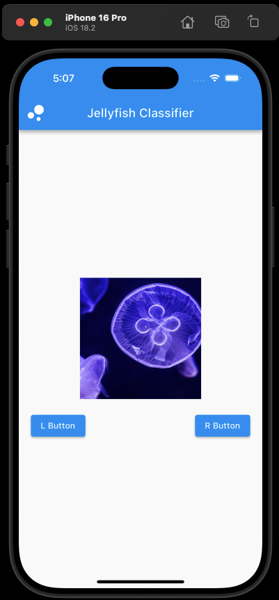
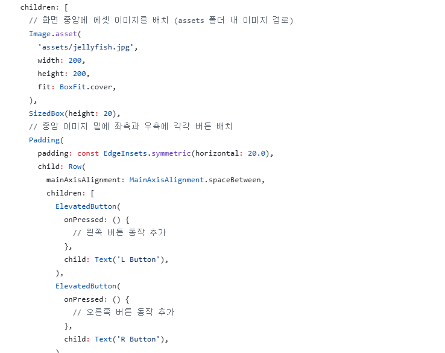

# AIFFEL Campus Online Code Peer Review Templete
- 코더 : 백승호
- 리뷰어 : 최유진


# PRT(Peer Review Template)
- [ ]  **1. 주어진 문제를 해결하는 완성된 코드가 제출되었나요?**
    - 문제에서 요구하는 최종 결과물이 첨부되었는지 확인
        - 중요! 해당 조건을 만족하는 부분을 캡쳐해 근거로 첨부


   서버 해파리 맞추는 거 확인, 어플 기본 틀은 했으나 연결하지 못하였다. 

- [x]  **2. 전체 코드에서 가장 핵심적이거나 가장 복잡하고 이해하기 어려운 부분에 작성된 
주석 또는 doc string을 보고 해당 코드가 잘 이해되었나요?**
    - 해당 코드 블럭을 왜 핵심적이라고 생각하는지 확인
    - 해당 코드 블럭에 doc string/annotation이 달려 있는지 확인
    - 해당 코드의 기능, 존재 이유, 작동 원리 등을 기술했는지 확인
    - 주석을 보고 코드 이해가 잘 되었는지 확인
 
    주석과 간단한 설명을 통해 잘 이해할 수 있었다.
        
- []  **3. 에러가 난 부분을 디버깅하여 문제를 해결한 기록을 남겼거나
새로운 시도 또는 추가 실험을 수행해봤나요?**
   잘 찾아볼 수 없었다.
        
- [x]  **4. 회고를 잘 작성했나요?**
//회고 백승호 : 어떻게 접근해야할지 생각하다가 시간을 오래사용하였다. 서버에 가중치를 업로드 하는 것과 해파리임을 맞추는것은 확인하였고 어플의 기본 틀은 만들 수 있었으나 버튼으로 서버의 응답을 연결하는 중요한 과정은 아직 완수 하지 못하였다. 너무 아쉽다.

회고를 잘 작성하였다.
        
- [x]  **5. 코드가 간결하고 효율적인가요?**
    - 파이썬 스타일 가이드 (PEP8) 를 준수하였는지 확인
    - 코드 중복을 최소화하고 범용적으로 사용할 수 있도록 함수화/모듈화했는지 확인
        - 중요! 잘 작성되었다고 생각되는 부분을 캡쳐해 근거로 첨부

코드가 간결하고 효율적으로 작성되었다.

# 회고(참고 링크 및 코드 개선)
```
# 리뷰어의 회고를 작성합니다.
# 이번에 다들 시간이 없어서 완벽하게 못한 분들이 많은 것 같습니다. 수고하셨습니다. (하루종일 하는 서브퀘스트면 성공할 수 있었을 것 같다는 생각....)
```
