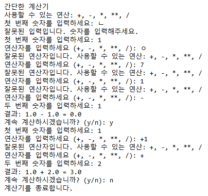
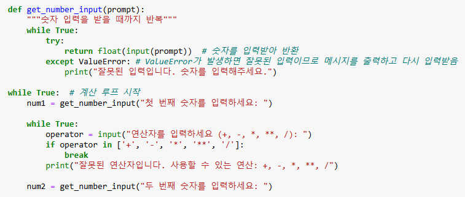
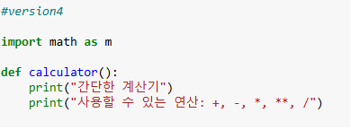
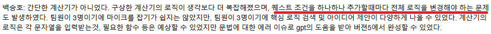
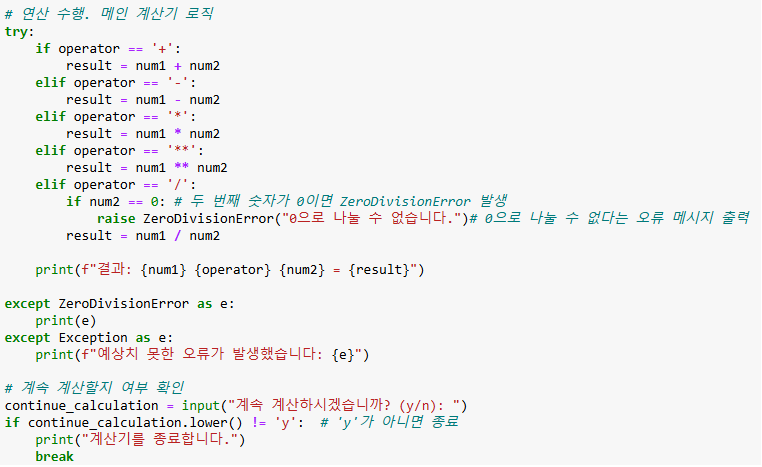

# AIFFEL Campus Online Code Peer Review Templete
- 코더 : 백승호
- 리뷰어 : 박종호


# PRT(Peer Review Template)
- [x]  **1. 주어진 문제를 해결하는 완성된 코드가 제출되었나요?**
       YES
             
        
    
- [x]  **2. 전체 코드에서 가장 핵심적이거나 가장 복잡하고 이해하기 어려운 부분에 작성된 
주석 또는 doc string을 보고 해당 코드가 잘 이해되었나요?**
    정수를 어떻게 입력받고 연산자를 어떻게 입력받고 그렇지 않을경우에 대한 오류나
    그것을 무한 반복한는것에 대한 코드로 가장 중요하다고 생각
    
    
        
- [x]  **3. 에러가 난 부분을 디버깅하여 문제를 해결한 기록을 남겼거나
새로운 시도 또는 추가 실험을 수행해봤나요?**
    Version 5를 제외한 나머지 부분들이 문제해결을 한 흔적들 
    제 실력이 한참 부족해서 어디서 오류가 난건지 찾기가 힘듬...
    
        
- [x]  **4. 회고를 잘 작성했나요?**
    잘 작성되었습니다.
    퀘스트를 작성할때마다 생기는 오류 그리고 그 오류들을 수정해나가는 과정이 Version 1234로 생각이 들어서
    잘 작성된거 같습니다
    
        
- [x]  **5. 코드가 간결하고 효율적인가요?**
    퀘스트 순서에 맞게 그리고 기능에 맞게 각각 나뉘어 있어서 효율적입니다.
    

# 회고(참고 링크 및 코드 개선)
```
# 항상 느끼는거지만 다른사람의 코딩을 보는것도 상당한 스킬이 필요한거 같습니다...
혼자서 만드는것도 힘들지만 다른사람의 코딩을 보고 배울수있을 정도의 훈련도 많이 필요한거 같습니다.

```
